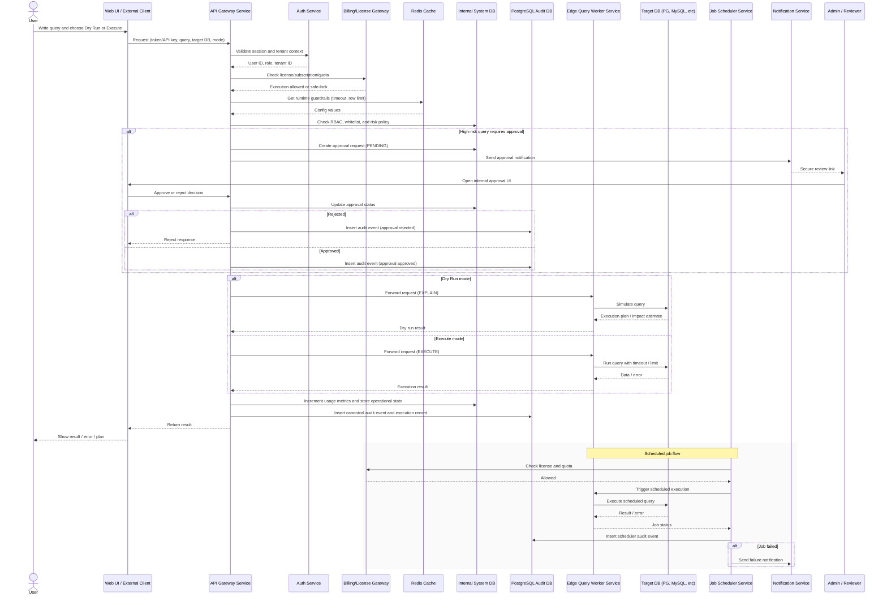

# audit-db

PostgreSQL audit database design notes and reference architecture.

This repository documents a best-case audit database design when the main operational databases remain separated by service/domain, while PostgreSQL is used for audit, reporting, and control-plane workloads.

## Context from PRD

The source PRD describes a commercial web-based database management platform with:
- multi-tenant cloud and single-tenant self-hosted deployment modes
- API Gateway, Auth Service, Billing/License Gateway, Redis, and Edge Query Worker
- approval workflow, scheduled jobs, notifications, and usage tracking
- detailed audit logging across UI, API, scheduler, and approval flows

In this repo, PostgreSQL is positioned as the audit/reporting/control-plane datastore around that architecture.

## Main Architecture Diagram

## Docs

- `docs/01-overview.md` — architecture summary and positioning of PostgreSQL
- `docs/02-architecture.md` — logical system architecture and data flow
- `docs/03-audit-data-model.md` — canonical audit schema and table design
- `docs/04-postgres-physical-design.md` — partitioning, indexing, retention, and security
- `docs/05-rollout-plan.md` — phased implementation and rollout plan
- `docs/06-sample-queries.md` — sample investigation and reporting queries
- `docs/07-prd-gap-analysis.md` — mapping between the source PRD and the current audit DB design, including open design decisions
